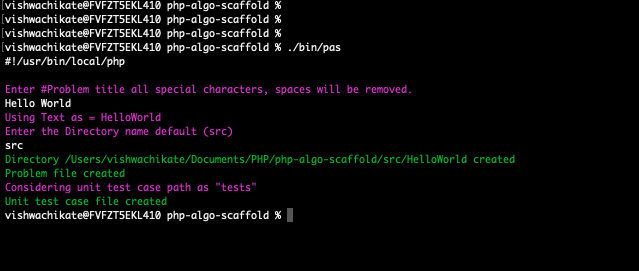

# PHP Algorithm Scaffold

I like solving problems on Leetcode and prefer using my local development environment mostly. I also Wanted to keep a track of all the problems which i have solved till now, so decided to maintain a [repository](https://github.com/vishwac09/LeetCodes) for it. So Created a strucutre which adheres to the PSR-4 __autoloading__ PHP-fig standard.

For every new problem i create folder under the "__src__" directory with a php file for the Problem and a unit test file under the "__tests__" directory. I created this library just to automate these file creation tasks.

## Usage

Create a project, and add this packages as __DEV__ dependancy. Check tjhe repo for more details [https://github.com/vishwac09/LeetCodes](https://github.com/vishwac09/LeetCodes)
#### Installation
Add via composer
```
composer require --dev vishwac09/php-algo-scaffold
```
### Run
Execute via
```
./vendor/bin/pas
```

